<!--
====================================================================
  MANAS PATHAK  //  github.com/Mapicx
  Profile README  ·  one visual language: glass panels + film grain
  Sections are full-bleed animated SVGs in /assets so the whole page
  reads as one continuous glass surface (GitHub can't set a page bg).
    hero-lux.svg → identity hero (liquid gradient name + mesh + grain)
    hero.svg     → whoami boot terminal
    projects.svg → selected work (glass cards)
    stack.svg    → toolkit (glass chips)
    footer.svg   → sign-off
  Repo name MUST be "Mapicx" (same as username) to show on your profile.
====================================================================
-->

<!-- ░░░░░░░░  HERO  ░░░░░░░░ -->

  

  
  
  
  

<!-- ░░░░░░░░  WHOAMI TERMINAL  ░░░░░░░░ -->

  

<!-- ░░░░░░░░  SELECTED WORK  ░░░░░░░░ -->

  

<!-- ░░░░░░░░  TOOLKIT  ░░░░░░░░ -->

  

<!-- ░░░░░░░░  TELEMETRY (dynamic — transparent bg to blend)  ░░░░░░░░ -->

  
  

  

<!-- ░░░░░░░░  FOOTER  ░░░░░░░░ -->

  

